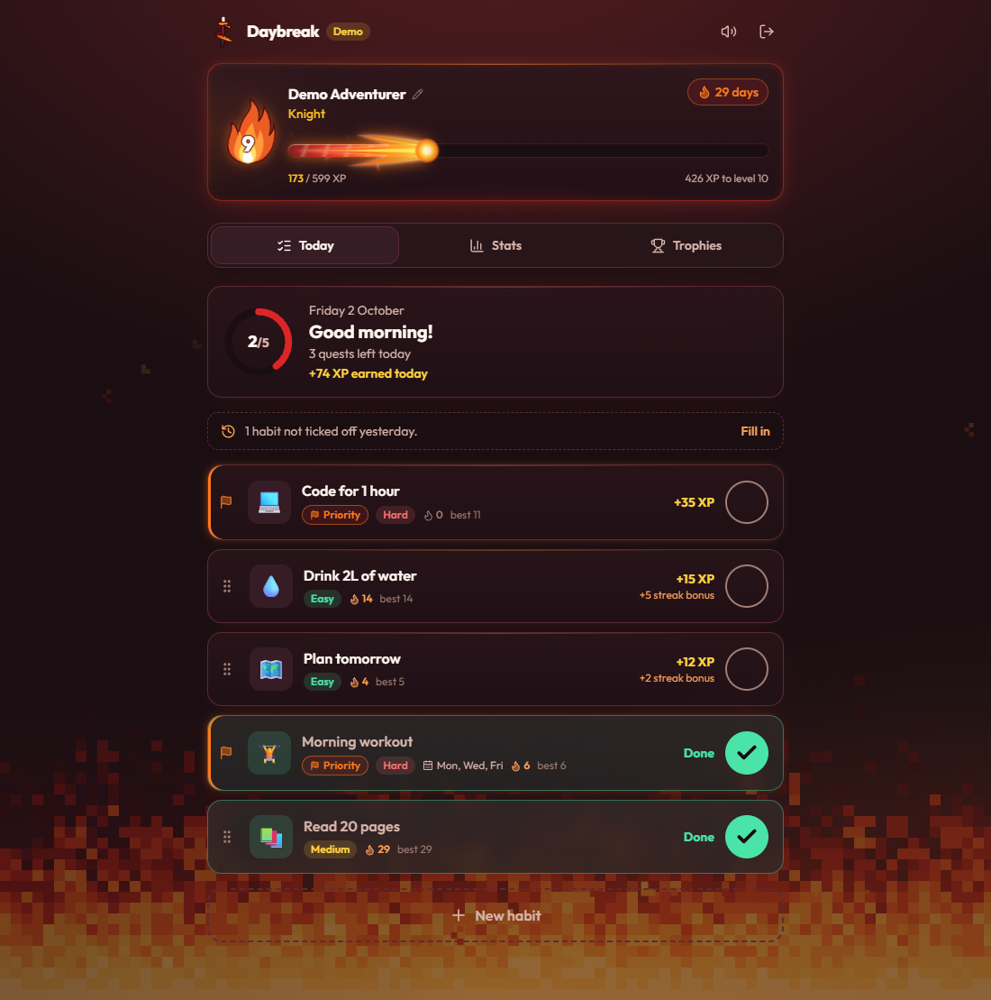
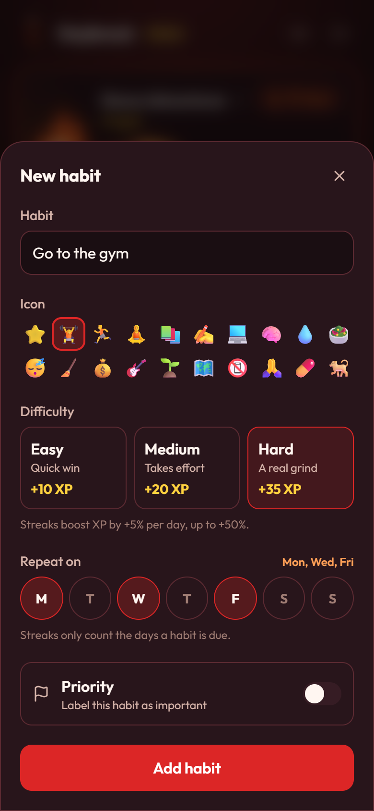
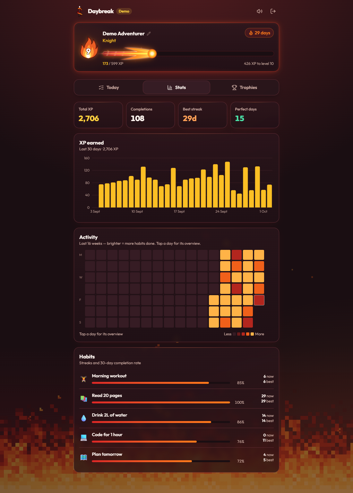
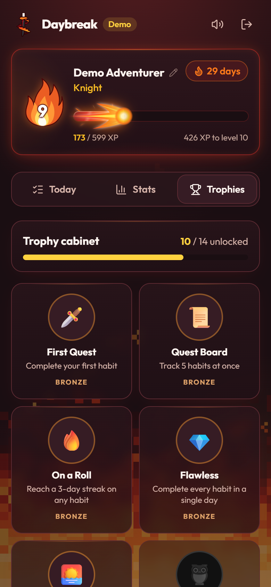

<p align="center">
  
</p>

# Daybreak

*Formerly QuestLog.*

**A gamified daily habit tracker with a fiery look.** Complete habits to earn XP, level up, keep streaks alive and unlock trophies, with confetti, sound effects and a level-up fanfare to make each tick feel rewarding.

**Try it:** [daybreak-pearl.vercel.app](https://daybreak-pearl.vercel.app). Click **Try the demo** to play without an account.

<p>
  
  
</p>

<p>
  
  
</p>

## Features

**Habits**
- Daily habits with an icon and a difficulty (Easy, Medium or Hard)
- **Custom schedules:** pick the weekdays a habit repeats on (e.g. Mon, Wed, Fri). Streaks only count due days, and a habit can still be done on an off day as an extra.
- **Priority** labels: priority habits are listed first, and finished habits move to the bottom
- **Drag to reorder** (or use the arrow keys)
- **Turn habits off** without losing their history, and back on again later
- **Fill in the last 7 days:** forgot to tick something yesterday? Fill it in for the XP it would have earned, and keep your streak.

**Game**
- **XP and levels.** Harder habits give more XP, and a streak adds +5% per day, up to +50%. Level titles go from *Novice* to *Mythic*, and the flame-shaped level badge grows and burns fiercer as you climb.
- **Streaks** per habit and overall, with current and best values
- **14 trophies** in bronze, silver and gold tiers, with progress bars for locked ones
- **Celebrations:** confetti, floating "+XP" text, synthesized sound effects, a level-up dialog and a perfect-day celebration

**Insights**
- **Daily overview:** tap any day to see what was done, what was missed and the XP earned
- **Stats:** 30-day XP chart, a 16-week activity heatmap and a completion rate per habit

**App**
- **Installable** as an app on phones and desktops (PWA), and it opens offline
- **Accounts** with Supabase Auth and a username, with data in Postgres behind Row Level Security
- **Demo mode:** try everything without an account; data stays in the browser
- Mobile-first, keyboard accessible, and respects `prefers-reduced-motion` and the mute button

All changes are listed in the [changelog](CHANGELOG.md).

## Tech stack

| Area | Choice |
|---|---|
| UI | React 19, TypeScript, Vite |
| Styling / motion | Tailwind CSS v4, Motion (Framer Motion) |
| Server state | TanStack Query (optimistic updates) |
| Backend | Supabase (Postgres + Auth + RLS) |
| Charts | Recharts (lazy-loaded) |
| App install / offline | vite-plugin-pwa (Workbox) |
| Testing / CI | Vitest, oxlint, GitHub Actions |
| Hosting | Vercel |

## Architecture

```
src/
├── game/          # Pure game engine: XP, levels, streaks, schedules, badges, stats (+ unit tests)
├── data/          # Repo interface with Supabase and demo (localStorage) implementations
│   ├── repo.ts
│   ├── supabase.ts
│   ├── demo.ts
│   └── queries.ts # TanStack Query hooks, optimistic complete/undo/reorder
├── views/         # Today, Stats, Trophies, Auth, Shell
├── components/    # HabitCard, PlayerCard, HabitForm, DayOverview, Modal, celebrations, fire effects
└── lib/           # dates, ordering, sound (Web Audio), confetti, types
supabase/migrations/  # SQL schema + RLS policies
```

**Design decisions:**

- **Completions are the single source of truth.** XP totals, levels, streaks and trophies are *derived* by a pure function (`computeProgress`), not stored as counters. They can't drift out of sync, and changing a game rule doesn't need a data migration.
- **XP is stored per completion.** The streak bonus depends on the streak at the moment you complete a habit. Recomputing it later would rewrite history.
- **Schedules keep their history.** Each habit stores when each schedule started, so changing one applies from today on and never turns past days into misses.
- **Repository pattern.** The UI talks to a `Repo` interface. Supabase and demo mode are two implementations of it, so adding another backend means one new file.
- **Optimistic updates.** Ticking a habit updates the UI and starts the celebration straight away. If the server rejects the write, the change is rolled back and you see a toast.
- **Dates are local calendar days** (`YYYY-MM-DD`). Date maths is done at noon UTC, so DST changes can't break a streak (this is tested).

## Getting started

### 1. Run it locally (demo mode, no setup)

```bash
npm install
npm run dev
```

Open http://localhost:5173 and click **Try the demo**.

### 2. Connect Supabase (real accounts and sync)

1. Create a free project at [supabase.com](https://supabase.com).
2. In the dashboard, open **SQL Editor → New query**, and run each file in `supabase/migrations/` in order (oldest first): paste its contents and click **Run**.
3. Go to **Project Settings → API** and copy the *Project URL* and the *anon public* key.
4. Copy `.env.example` to `.env` and fill in both values.
5. Under **Authentication → URL Configuration**, set the *Site URL* to your app's URL (`http://localhost:5173` for local development, then your deployed URL).
6. Restart `npm run dev`. You can now create an account.

> Tip: to skip email confirmation during development, turn off **Authentication → Providers → Email → Confirm email**.

### 3. Deploy (free) to Vercel

1. Push the repo to GitHub.
2. On [vercel.com](https://vercel.com), click **Add New → Project** and import the repo. The Vite preset is detected automatically.
3. Add `VITE_SUPABASE_URL` and `VITE_SUPABASE_ANON_KEY` as environment variables, then deploy.
4. Add the Vercel URL to Supabase's Site URL and Redirect URLs.

## Scripts

| Command | What it does |
|---|---|
| `npm run dev` | Start the dev server |
| `npm test` | Run the unit tests |
| `npm run lint` | Lint with oxlint |
| `npm run typecheck` | Check types |
| `npm run build` | Production build to `dist/` |

## Game rules

| Difficulty | Base XP |
|---|---|
| Easy | 10 |
| Medium | 20 |
| Hard | 35 |

- **Streak bonus:** +5% for each due day in a row you completed the habit before today, up to +50%.
- **Level curve:** the total XP needed for level *n* is `60 × (n − 1)^1.8`.
- A streak stays alive until the end of today and only breaks after a missed **due** day. Days a habit isn't scheduled are skipped.
- Doing a habit on a day it isn't due is an **extra**: it earns XP but doesn't change its streak.
- The last **7 days** can be filled in or undone. Older days are locked.

## Roadmap

- [x] Custom schedules (e.g. gym on Mon, Wed, Fri)
- [ ] "3 times a week" schedules
- [ ] One-off tasks alongside daily habits
- [ ] Daily bonus quests ("complete 3 hard habits before noon")
- [ ] Coins and a personal reward shop
- [x] Installable app (PWA)
- [ ] Reminder notifications
- [x] Drag-to-reorder habits
